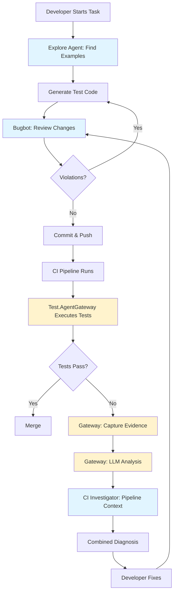

# SubAgent Integration Architecture

**Visual guide to how Cursor SubAgents integrate with Test.AgentGateway**

---

## 🏗️ System Architecture

```
┌─────────────────────────────────────────────────────────────────────┐
│                        Development Workflow                          │
│                    (Cursor IDE + SubAgents)                         │
└─────────────────────────────────────────────────────────────────────┘
                                   │
                    ┌──────────────┼──────────────┐
                    │              │              │
                    ▼              ▼              ▼
            ┌──────────┐   ┌──────────┐   ┌──────────┐
            │ Explore  │   │  Bugbot  │   │   CI     │
            │  Agent   │   │  Review  │   │Investigator│
            └──────────┘   └──────────┘   └──────────┘
                    │              │              │
                    └──────────────┼──────────────┘
                                   │
                                   ▼
                    ┌──────────────────────────────┐
                    │     Test Codebase            │
                    │  ├── Features/               │
                    │  ├── Steps/                  │
                    │  └── PageObjects/            │
                    └──────────────────────────────┘
                                   │
                                   ▼
┌─────────────────────────────────────────────────────────────────────┐
│                     Test Execution Layer                             │
│                    (Test.AgentGateway)                              │
└─────────────────────────────────────────────────────────────────────┘
                                   │
                    ┌──────────────┼──────────────┐
                    │              │              │
                    ▼              ▼              ▼
            ┌──────────┐   ┌──────────┐   ┌──────────┐
            │   Run    │   │ Analyze  │   │ History  │
            │  Tests   │   │ Failures │   │ Patterns │
            └──────────┘   └──────────┘   └──────────┘
                    │              │              │
                    └──────────────┼──────────────┘
                                   │
                                   ▼
                    ┌──────────────────────────────┐
                    │      Evidence Store          │
                    │  ├── Screenshots             │
                    │  ├── Traces                  │
                    │  ├── Logs                    │
                    │  └── Test Results            │
                    └──────────────────────────────┘
```

---

## 🔄 Complete Development Lifecycle



**Legend:**
- 🔵 Blue = Cursor SubAgents (Development time)
- 🟡 Yellow = Test.AgentGateway (Runtime)

---

## 🎯 Integration Points

### 1. **Pre-Development** (SubAgents)

```
Developer Needs Context
        ↓
   Explore Agent
        ↓
  Scans Codebase
        ↓
Returns: Structure, Patterns, Examples
        ↓
Developer Understands Framework
```

**Tools:** `explore` SubAgent  
**Speed:** 30 seconds  
**Output:** Structural insights, test inventory, examples

---

### 2. **Development** (Skills + SubAgents)

```
Developer Writes Test
        ↓
Framework Skills Generate Code
        ↓
   Bugbot Reviews
        ↓
  {Validates POM, Naming, Quality}
        ↓
Developer Fixes Issues
        ↓
Bugbot Approves
```

**Tools:** Framework skills, `bugbot` SubAgent  
**Speed:** 1-2 minutes review  
**Output:** Code quality feedback, violations, recommendations

---

### 3. **Execution** (Test.AgentGateway)

```
CI Triggers Test Run
        ↓
Test.AgentGateway Receives Request
        ↓
Validates: Project, Filters, Timeout
        ↓
Executes: dotnet test
        ↓
Captures: Evidence on Failure
        ↓
Returns: TestRunResult
```

**Tools:** Test.AgentGateway JSON-lines protocol  
**Speed:** Test duration + 2-3 seconds overhead  
**Output:** Test results, evidence paths, TRX

---

### 4. **Analysis** (Test.AgentGateway + SubAgents)

```
Test Fails
        ↓
Gateway: Capture Evidence
        ├── Screenshots
        ├── Playwright Traces
        ├── Console Logs
        └── Stack Traces
        ↓
Gateway: LLM Analysis
        ├── Classification
        ├── Confidence
        └── Recommendations
        ↓
CI Investigator: Pipeline Analysis
        ├── Environment
        ├── Dependencies
        └── Configuration
        ↓
Combined Root Cause Diagnosis
```

**Tools:** Gateway LLM analyzer + `ci-investigator` SubAgent  
**Speed:** 5-10 seconds Gateway + 30 seconds SubAgent  
**Output:** Classification, confidence, pipeline context, fix recommendations

---

## 🔀 Data Flow Diagram

```
┌──────────────┐
│  Developer   │
└──────┬───────┘
       │
       ▼
┌──────────────┐     Chat/Commands     ┌──────────────┐
│    Cursor    │◄──────────────────────►│  SubAgents   │
│     IDE      │                        │  (explore,   │
└──────┬───────┘                        │   bugbot,    │
       │                                │   ci-inv)    │
       │                                └──────┬───────┘
       │                                       │
       ▼                                       ▼
┌──────────────────────────────────────────────────────┐
│              Test Codebase (Git Repo)                │
│  ├── .cursor/                                        │
│  │   ├── rules/AGENTS.md  ◄──── Read by SubAgents   │
│  │   └── hooks/           ◄──── Automated workflows │
│  ├── tests/                                          │
│  │   ├── UI.Tests/        ◄──── Reviewed by Bugbot  │
│  │   ├── API.Tests/                                  │
│  │   └── Integration.Tests/                          │
│  └── agent/Test.AgentGateway.Cli/                    │
└──────────────┬───────────────────────────────────────┘
               │
               │ JSON-lines (stdin/stdout)
               ▼
┌──────────────────────────────────────────────────────┐
│         Test.AgentGateway (Runtime Engine)           │
│                                                       │
│  ┌─────────────┐  ┌──────────────┐  ┌─────────────┐│
│  │   Execute   │  │   Analyze    │  │   Track     ││
│  │   Tests     │  │   Failures   │  │   History   ││
│  └─────────────┘  └──────────────┘  └─────────────┘│
└──────────────┬───────────────────────────────────────┘
               │
               ▼
┌──────────────────────────────────────────────────────┐
│            Evidence Store (File System)               │
│  Evidence/<runId>/                                    │
│  ├── context.json                                     │
│  ├── test-result.json  ◄──── Read by CI Investigator │
│  ├── screenshot.png                                   │
│  ├── trace.zip                                        │
│  └── run.log.jsonl                                    │
└───────────────────────────────────────────────────────┘
```

---

## 🎭 Actor Responsibilities

### Cursor SubAgents (Development Assistant)

| SubAgent | Reads | Writes | Responsibilities |
|----------|-------|--------|------------------|
| **explore** | Source code, Features, Steps, PageObjects | N/A | Map structure, find patterns, verify compliance |
| **bugbot** | Uncommitted changes, `.cursor/rules/` | N/A | Review code quality, enforce POM, check naming |
| **security-review** | Test code, configs | N/A | Find credentials, check security practices |
| **ci-investigator** | CI logs, Evidence/ | N/A | Diagnose pipeline failures, environment issues |
| **generalPurpose** | Entire codebase | Source code | Generate tests, refactor patterns, batch operations |

### Test.AgentGateway (Execution Engine)

| Component | Reads | Writes | Responsibilities |
|-----------|-------|--------|------------------|
| **Gateway** | Test projects, appsettings.json | Evidence/ | Execute tests, capture output, normalize TRX |
| **LLM Analyzer** | Evidence/, test results | Evidence/.history/ | Classify failures, provide recommendations |
| **History Tracker** | Evidence/.history/ | Evidence/.history/ | Track patterns, identify flaky tests |
| **Discovery** | .feature files | N/A | Scan Gherkin, parse metadata |

---

## 🔐 Security Boundaries

```
┌─────────────────────────────────────────────────┐
│         Cursor IDE (Local Machine)              │
│  ┌───────────────────────────────────────────┐ │
│  │  SubAgents (Read-Only to Codebase)       │ │
│  │  - Can READ source files                 │ │
│  │  - Can WRITE only via developer approval │ │
│  └───────────────────────────────────────────┘ │
└─────────────────────────────────────────────────┘
                      │
                      ▼
┌─────────────────────────────────────────────────┐
│     Test Codebase (Version Controlled)          │
│     - Developer controls all changes            │
│     - Git tracks all modifications              │
└─────────────────────────────────────────────────┘
                      │
                      ▼
┌─────────────────────────────────────────────────┐
│   Test.AgentGateway (Sandboxed Execution)      │
│  - Allowlisted project paths only              │
│  - No command injection                         │
│  - Evidence isolated per run                    │
└─────────────────────────────────────────────────┘
```

**Key Principles:**
1. ✅ SubAgents never execute tests (read-only)
2. ✅ Gateway never modifies source code (execute-only)
3. ✅ All code changes require developer approval
4. ✅ Evidence is read-only after capture

---

## ⚡ Performance Characteristics

| Operation | Tool | Typical Duration | Parallelizable |
|-----------|------|------------------|----------------|
| **Code exploration** | SubAgent (explore) | 10-60 seconds | No |
| **Code review** | SubAgent (bugbot) | 30-90 seconds | No |
| **Test discovery** | Gateway | 1-2 seconds | No |
| **Test execution** | Gateway | Varies (test-dependent) | Yes (NUnit parallel) |
| **Failure analysis** | Gateway (LLM) | 3-10 seconds | Yes (per test) |
| **CI investigation** | SubAgent (ci-inv) | 20-45 seconds | No |

**Optimization Tips:**
- Run SubAgent exploration once, cache insights
- Bugbot review in pre-commit hook (catches issues early)
- Gateway analysis parallelizes across multiple failed tests
- CI investigation only on actual failures

---

## 🔄 State Management

### SubAgent State
- **Stateless:** Each SubAgent invocation is independent
- **Context:** Provided via prompt (file paths, patterns)
- **Memory:** No persistent memory between runs

### Gateway State
- **Per-Run:** Each `runId` isolated
- **History:** Persistent across runs in `Evidence/.history/`
- **Configuration:** `appsettings.json` loaded at startup

---

## 🎯 Decision Matrix: Which Tool When?

| Scenario | Use This | Why |
|----------|----------|-----|
| Need to understand code structure | `explore` SubAgent | Fast codebase scanning |
| Before committing changes | `bugbot` SubAgent | Catch violations early |
| Test failed in CI | `ci-investigator` + Gateway | Combined context |
| Generate multiple tests | Skills + `generalPurpose` | Batch generation |
| Classify test failure | Gateway LLM | Evidence-based analysis |
| Find flaky tests | Gateway history | Historical pattern analysis |
| Security audit | `security-review` SubAgent | Specialized security checks |
| Refactor across many files | `generalPurpose` SubAgent | Multi-file operations |

---

## 📈 Metrics & Monitoring

Track these integration metrics:

### SubAgent Effectiveness
- **Review Accuracy:** % of real issues found by Bugbot
- **Time Saved:** Manual review time vs Bugbot time
- **Exploration Speed:** Time to find patterns vs manual search

### Gateway Performance
- **Analysis Accuracy:** LLM classification vs actual root cause
- **Evidence Completeness:** % of failures with full evidence
- **Pattern Detection:** % of flaky tests identified

### Combined Impact
- **Issue Prevention:** Violations caught pre-commit vs in CI
- **Debug Time:** CI failure resolution time (with vs without tools)
- **Code Quality:** POM compliance rate over time

---

## 🚀 Future Enhancements

### Phase 1 (Current)
- ✅ SubAgent integration documented
- ✅ Automated hooks for common workflows
- ✅ Combined SubAgent + Gateway workflows

### Phase 2 (Planned)
- 🔄 MCP adapter for Test.AgentGateway
- 🔄 SubAgent orchestration (multiple agents in parallel)
- 🔄 Real-time metrics dashboard

### Phase 3 (Future)
- 🔮 Auto-fix workflows (SubAgent proposes + applies fixes)
- 🔮 Predictive analysis (identify issues before they occur)
- 🔮 Learning from history (improve patterns over time)

---

## 📚 Related Documentation

- [SubAgent Integration Guide](subagent-integration-guide.md) - Complete integration guide
- [SubAgent Workflows](subagent-workflows.md) - Practical workflow examples
- [Agent Protocol](agent-protocol.md) - Test.AgentGateway protocol reference
- [Architecture](architecture.md) - Overall system architecture

---

**This architecture enables a seamless workflow:** SubAgents help you write quality code, Test.AgentGateway ensures it works correctly. Together, they create a world-class testing experience! 🚀
