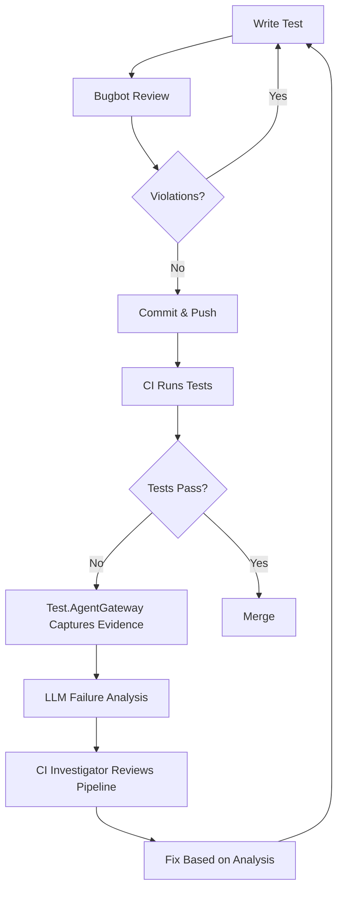

# Cursor SubAgent Integration Guide

**Status:** ✅ Production Ready  
**Last Updated:** 2026-09-09  
**Framework Phase:** P5 - Development Workflow Automation

---

## 🎯 Overview

This framework now integrates **Cursor SubAgents** into the development workflow, providing AI-powered assistance for test development, code review, and quality assurance alongside the existing **Test.AgentGateway** for test execution and failure analysis.

### Two Complementary Agent Systems

| Aspect | Test.AgentGateway | Cursor SubAgents |
|--------|-------------------|------------------|
| **Purpose** | Runtime test execution & analysis | Development-time code assistance |
| **When** | During test runs | While writing/reviewing code |
| **What** | Execute tests, analyze failures | Explore code, review changes, debug |
| **Output** | Test results, failure classifications | Code insights, recommendations |
| **Protocol** | JSON-lines (stdio) | Cursor IDE integration |

**Key Insight:** SubAgents help you *write better tests*, while Test.AgentGateway helps you *understand test failures*.

---

## 🚀 Available SubAgents

### 1. **Explore Agent** - Code Discovery & Analysis
**Best for:** Understanding codebase structure, finding patterns, mapping dependencies

#### Use Cases:
- 🔍 **Find all tests by layer** - `"Map all UI/API/Integration tests"`
- 📊 **Verify POM compliance** - `"Check if all Page Objects follow naming convention"`
- 🗺️ **Understand architecture** - `"Show me how the Gateway protocol works"`
- 🔎 **Locate violations** - `"Find any direct Playwright calls in step definitions"`

#### Example Workflow:
```
You: "Find all smoke tests across all layers"
→ Explore agent scans Features/, counts scenarios, returns structured map
→ You get complete inventory in 30 seconds
```

#### When to Use:
- ✅ Onboarding new team members
- ✅ Before refactoring (understand impact)
- ✅ Auditing test coverage by layer/category
- ✅ Finding examples to follow

---

### 2. **Bugbot Agent** - Automated Code Review
**Best for:** Pre-commit quality checks, POM pattern enforcement

#### Use Cases:
- ✅ **Enforce POM rules** - Catches direct Playwright calls in steps
- ✅ **Naming convention checks** - Verifies {Feature}.feature → {Feature}Steps.cs → {Feature}Page.cs
- ✅ **Code quality** - Identifies anti-patterns before merge
- ✅ **Framework compliance** - Ensures adherence to AGENTS.md guidelines

#### Example Workflow:
```
You: "Review my branch changes with Bugbot"
→ Bugbot analyzes uncommitted changes
→ Reports violations: "2 direct Page.GotoAsync() calls in Steps"
→ Recommends: "Move navigation to Page Object"
```

#### When to Use:
- ✅ Before creating PR
- ✅ After writing new tests
- ✅ When refactoring existing tests
- ✅ To validate framework compliance

---

### 3. **Security Review Agent** - Security Analysis
**Best for:** Checking test code for security vulnerabilities

#### Use Cases:
- 🔐 **Credential exposure** - Finds hardcoded API keys, passwords
- 🔐 **Sensitive data** - Identifies PII in test data or logs
- 🔐 **Configuration review** - Validates secure appsettings patterns

#### Example Workflow:
```
You: "Run security review on my API test changes"
→ Security agent scans changes
→ Reports: "Hardcoded API key in ApiTests.cs line 42"
→ Recommends: "Use environment variable or config"
```

#### When to Use:
- ✅ Before committing authentication tests
- ✅ When adding new API integrations
- ✅ Reviewing configuration files
- ✅ Compliance audits

---

### 4. **CI Investigator Agent** - Pipeline Failure Analysis
**Best for:** Diagnosing test failures in CI/CD pipelines

#### Use Cases:
- 🔴 **Failed PR checks** - `"Why did the UI tests fail in CI?"`
- 🔍 **Environment differences** - Compare local vs CI behavior
- 🐛 **Flaky test diagnosis** - Identify timing/environment issues

#### Example Workflow:
```
PR fails in GitHub Actions
You: "Investigate the failed UI test check"
→ CI Investigator reads pipeline logs
→ Identifies: "Chromium not installed in CI"
→ Recommends: "Add Playwright install step to workflow"
```

#### When to Use:
- ✅ PR checks fail unexpectedly
- ✅ Tests pass locally but fail in CI
- ✅ Investigating flaky test patterns
- ✅ Deployment pipeline issues

---

### 5. **General Purpose Agent** - Multi-Step Tasks
**Best for:** Complex tasks requiring multiple operations

#### Use Cases:
- 🔄 **Batch operations** - Generate multiple tests simultaneously
- 🏗️ **Large refactors** - Update patterns across many files
- 📝 **Documentation updates** - Sync code and docs
- 🧪 **Test generation** - Create comprehensive test suites

#### Example Workflow:
```
You: "Generate API tests for all User endpoints"
→ General agent explores API controllers
→ Creates feature files for each endpoint
→ Generates step definitions and test data
→ Validates against framework guidelines
```

#### When to Use:
- ✅ Generating multiple related tests
- ✅ Framework-wide refactoring
- ✅ Complex multi-file changes
- ✅ Research + implementation tasks

---

## 🔄 Integration with Test.AgentGateway

### Combined Workflow Example



### Practical Example:

#### Scenario: Adding New Checkout Tests

**Step 1: Explore (SubAgent)**
```
You: "Show me existing checkout patterns"
→ Explore agent maps current checkout tests
→ Identifies: DemoButtonInteraction as reference
```

**Step 2: Generate Tests (Your Skills)**
```
You: "Generate checkout flow tests from this user story"
→ tests-from-user-story skill creates Feature, Steps, Page Object
```

**Step 3: Review (SubAgent)**
```
You: "Run Bugbot review on my changes"
→ Bugbot validates POM compliance
→ Reports: All good ✅
```

**Step 4: Commit & CI**
```
→ Push to GitHub
→ CI runs tests via Test.AgentGateway
→ One test fails
```

**Step 5: Investigate (SubAgent + Gateway)**
```
You: "Why did the checkout test fail in CI?"
→ CI Investigator: "Timeout waiting for payment gateway"
→ Test.AgentGateway LLM Analysis: "Classification: Environment"
→ Combined insight: CI environment missing payment stub
```

**Step 6: Fix**
```
→ Add mock payment service to CI environment
→ Rerun via Test.AgentGateway locally
→ Bugbot review again
→ Merge ✅
```

---

## 📋 Best Practices

### When to Use SubAgents

#### ✅ DO Use SubAgents For:
1. **Pre-commit quality checks** - Run Bugbot before every PR
2. **Codebase exploration** - Understand structure before making changes
3. **Bulk operations** - Generate/refactor multiple tests
4. **CI debugging** - Investigate pipeline failures
5. **Onboarding** - Help new developers understand framework

#### ❌ DON'T Use SubAgents For:
1. **Test execution** - Use Test.AgentGateway directly
2. **Production test runs** - SubAgents are development tools
3. **Failure analysis** - Use Test.AgentGateway LLM analyzer
4. **Single-file edits** - Just edit directly (faster)

---

## 🎯 Workflow Integration Points

### 1. **Feature Development**
```
Explore → Design → Generate → Review (Bugbot) → Commit
```

### 2. **Test Maintenance**
```
Explore violations → Fix → Review (Bugbot) → Verify build → Commit
```

### 3. **CI/CD Integration**
```
CI fails → CI Investigator → Test.AgentGateway analysis → Fix → Rerun
```

### 4. **Refactoring**
```
Explore scope → Plan changes → General Agent refactor → Bugbot review → Test
```

---

## 🔧 Automated Workflows (Hooks)

See `.cursor/hooks/` for automated SubAgent workflows:

- **`pre-commit-review.json`** - Auto-run Bugbot before commit
- **`test-exploration.json`** - Periodic test inventory
- **`ci-failure-alert.json`** - Auto-investigate CI failures

---

## 📊 Success Metrics

Track SubAgent effectiveness:

| Metric | Target | How to Measure |
|--------|--------|----------------|
| **POM Violations** | 0 | Bugbot catches all before commit |
| **CI Investigation Time** | < 5 min | CI Investigator + Gateway analysis |
| **Test Generation Speed** | 10x faster | Compare manual vs SubAgent-assisted |
| **Code Quality** | 9.5/10 | Framework health score from explore |

---

## 🎓 Training & Onboarding

### For New Team Members:

**Week 1: Learn the Framework**
```
1. "Explore the test framework structure"
2. "Show me a complete UI test example"
3. "Explain the Page Object Model pattern"
```

**Week 2: Write First Test**
```
1. "Generate a simple login test"
2. "Review my test with Bugbot"
3. "Why did my test fail?" (Gateway analysis)
```

**Week 3: Advanced Workflows**
```
1. "Refactor all login tests to new pattern"
2. "Investigate this flaky test"
3. "Generate API tests for auth endpoints"
```

---

## 🚨 Troubleshooting

### SubAgent Not Finding Issues
**Problem:** Bugbot doesn't catch violations  
**Solution:** Ensure .cursor/rules/AGENTS.md is up to date

### Slow Exploration
**Problem:** Explore agent takes too long  
**Solution:** Scope searches with specific directories or patterns

### CI Investigator Can't Access Logs
**Problem:** Agent can't read CI output  
**Solution:** Ensure you have gh CLI configured or copy logs locally

---

## 📚 Related Documentation

- [Agent Protocol](agent-protocol.md) - Test.AgentGateway JSON-lines protocol
- [LLM Failure Analysis](llm-failure-analysis-guide.md) - Runtime failure analysis
- [AGENTS.md](../.cursor/rules/AGENTS.md) - AI assistant guidelines
- [Test Layers Guide](test-layers-guide.md) - Framework architecture

---

## 🔮 Future Enhancements

Planned SubAgent integrations:

- 🔄 **Auto-fix workflows** - SubAgent applies fixes automatically
- 📊 **Coverage analysis** - Combine SubAgent exploration + coverage tools
- 🤖 **Agent orchestration** - Multiple SubAgents work together
- 📈 **Metrics dashboard** - Track SubAgent usage and effectiveness

---

**Next Steps:**
1. Read the [SubAgent Workflows Guide](subagent-workflows.md)
2. Check `.cursor/hooks/` for automation examples
3. Try the example workflows in your next feature
4. Share feedback on SubAgent effectiveness

---

**Remember:** SubAgents are **development assistants**, Test.AgentGateway is your **test execution engine**. Use them together for maximum productivity! 🚀
